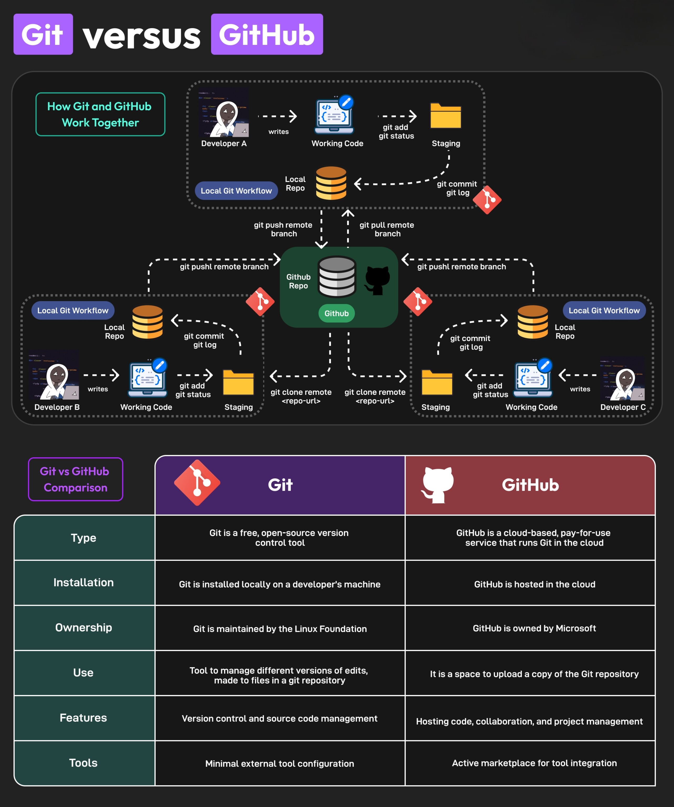
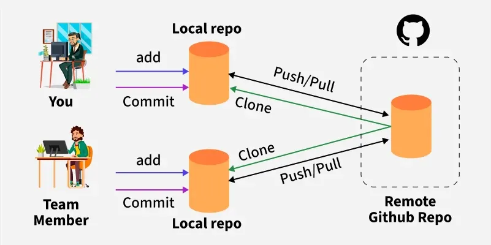

# 🚀 Git Setup & Workflow Guide & some commands


## 📊 Git &Github Workflow Diagram

| **Git Workflow**        | **Git And Github**            | **Network connection**            | 
|--------------------------------|------------------------------------|------------------------------------|
|  |  |  |


<br>
<h3>Above diagram shows:</h3>

- **Working Directory** → where you edit files  
- **Staging Area (Index)** → use `git add <file>` to stage changes  
- **Local Repository (HEAD)** → use `git commit -m "message"` to commit locally  
- **Remote Repository (Github)** → use `git push` to upload to GitHub  
<br>
<h3>if you wan't visual setups and info</h3>
<h4>here is link ▶️ </h4>
<h1>🔀Quick Flow🌊</h1>
1. Git install<br>
2. Create a account on github<br>
3. Create a folder<br>
       nikhil workspace<br>

           |          
           |-- git<br>
                |--  git bash<br>
                      |<br>
                      |-- code . ; exit

4. Inside VS code<br>
5. Index.html ,login.html<br>
6. Open terminal --> powershell --> git bash<br>
7. git init<br>
8. ls -a<br>
9. Authentaction<br>
    • git config --global user.name "Your Name"<br>
    • git config --global user.email "Your email"<br>
    • git config --global  --list<br>

10. git status -s<br>
11. git add.
12. git status -s
13. git commit -m "added"
14. git status -s
15. git logs
    git logs --oneline
16. Create repo on github
17. git remote add orgin <url>
    git remote rm origin
18. Come to the terminal --> and past
19. git remote -v
20. git push -u origin master

<h1>📊Git Status</h1>

[Staging Area] ---> [L] [R] <--- [Current Directory]

? ? → Untracked

A [ ] → Added to staging area

[ ] M → Modified in current directory

M [ ] → Modified & added to staging area

U U → File has conflicts


<h1>🛠️💻Git and Github Setup</h1>

<h2>🔧 Step 1: Install Git </h2>

<h4>🪟On Windows </h4>

1. Download from https://git-scm.com/download/win.
   
2. Install with default options (make sure “Add Git to PATH” is selected).
   
3. Verify installation:

4. git --version

<h4>🐧On Linux (Ubuntu/Debian)</h4>

• sudo apt update <br>
• sudo apt install git -y <br>
• git --version <br>

<h4>🍎On macOS</h4>

• brew install git <br>
• git --version <br>
 
 <h2>⚙ Step 2: Configure Git (one-time only) </h2>
 
➼ Set your Git username & email (must match your GitHub account email for commits to show): <br>

➼ git config --global user.name "Your Name" <br>

➼ git config --global user.email "your-email@example.com" <br>

➼ Check config: <br>

➼ git config --list 
 
  <h2>⚡Step 3: Initialize Git in Your VS Code Project </h2>
  
‣ Open VS Code → Terminal inside your project folder:  <br>

‣ cd path/to/your/project  <br>

‣ git init 
 
  <h2>💬Step 4: Add & Commit Files </h2>
• git add . <br>

• git commit -m "Initial commit" <br>

• This stages all files and commits them (preserving folder/file sequence). <br>
 
  
  <h2>➕Step 5: Create Repository on GitHub </h2>
1. Go to GitHub. <br>

2. Click New Repository → name it (e.g., my-project). <br>

3. Don’t initialize with README (since you already have files locally). <br>
 
  <h2>🌐Step 6: Connect Local Project to GitHub</h2> 

Copy repo link (HTTPS or SSH). Example (HTTPS): <br>

git remote add origin https://github.com/username/my-project.git <br>
 
  <h2>🫸Step 7: Push to GitHub</h2> 

• git branch -M main      # make sure branch name is 'main' <br>

• git push -u origin main <br>

• Now your project is on GitHub with the same file/folder structure as in VS Code  <br>       
 
  <h2>🔐Step 8: Verify✅</h2> 
  
• Open your GitHub repo in the browser → You’ll see all files in the same sequence. <br>

• From now on, just do: <br>

• git add . <br>

• git commit -m "Your changes" <br>

• git push <br>


<h1>Some Commands</h1>


## 🧠 Git Command Cheat Sheet

Here’s a simple list of the most used **Git commands** with explanations and usage examples — easy to remember, easy to use. 🚀

| Command | Description | Example |
| -------- | ------------ | -------- |
| `git init` | Create a new local Git repository in your project folder | `git init` |
| `git clone <repo-url>` | Clone (download) a Git repository from GitHub/GitLab to your system | `git clone git@gitlab.com:username/project.git` |
| `git status` | Show current changes, staged files, and branch info | `git status` |
| `git add .` | Add all files for the next commit | `git add .` |
| `git add <file>` | Add a specific file to commit | `git add index.html` |
| `git commit -m "message"` | Commit changes with a message | `git commit -m "Initial commit"` |
| `git log` | Show commit history | `git log` |
| `git diff` | Show differences between modified files and last commit | `git diff` |
| `git branch` | List all local branches | `git branch` |
| `git branch <name>` | Create a new branch | `git branch feature-login` |
| `git checkout <branch>` | Switch to another branch | `git checkout main` |
| `git checkout -b <branch>` | Create and switch to a new branch | `git checkout -b dev` |
| `git merge <branch>` | Merge another branch into the current one | `git merge dev` |
| `git remote -v` | List all linked remote repositories | `git remote -v` |
| `git remote add origin <url>` | Connect your local repo to a remote one | `git remote add origin git@gitlab.com:user/repo.git` |
| `git push -u origin main` | Push your code to the remote repo (main branch) | `git push -u origin main` |
| `git push` | Push latest commits to remote | `git push` |
| `git pull` | Fetch and merge changes from remote | `git pull` |
| `git fetch` | Download latest commits without merging | `git fetch` |
| `git reset <file>` | Unstage a file added to commit | `git reset index.html` |
| `git reset --hard` | Reset all changes to last commit | `git reset --hard` |
| `git rm <file>` | Remove a file from Git tracking | `git rm old.txt` |
| `git mv <old> <new>` | Rename or move a file | `git mv oldname.txt newname.txt` |
| `git stash` | Temporarily save uncommitted changes | `git stash` |
| `git stash pop` | Reapply the last stashed changes | `git stash pop` |
| `git rebase <branch>` | Reapply commits on top of another branch | `git rebase main` |
| `git tag <name>` | Create a new tag for a commit (versioning) | `git tag v1.0` |
| `git show <commit-id>` | Show details of a specific commit | `git show a1b2c3d` |
| `git config --global user.name "Your Name"` | Set your username | `git config --global user.name "Nikki"` |
| `git config --global user.email "you@example.com"` | Set your email | `git config --global user.email "nikki@example.com"` |
| `git revert <commit-id>` | Undo a specific commit (safely creates a new commit) | `git revert a1b2c3d` |
| `git log --oneline` | Show commits in a short one-line format | `git log --oneline` |
| `git branch -d <branch>` | Delete a branch locally | `git branch -d dev` |
| `git push origin --delete <branch>` | Delete a branch remotely | `git push origin --delete dev` |
| `git clean -fd` | Delete all untracked files and folders | `git clean -fd` |
| `git blame <file>` | Show who last edited each line in a file | `git blame app.js` |
| `git show-branch` | Show branches and commits graphically | `git show-branch` |
| `git reflog` | Show history of all your HEAD changes | `git reflog` |
| `git help <command>` | Get help for a Git command | `git help push` |

---

## 🧩 Common Git Workflows

### 🔹 Start a New Project
```bash
git init
git add .
git commit -m "Initial commit"
git branch -M main
git remote add origin git@gitlab.com:user/repo.git
git push -u origin main


